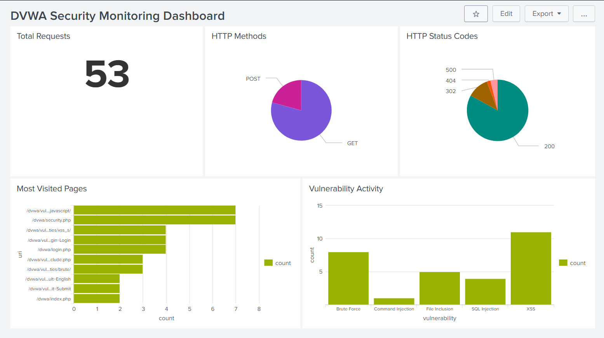
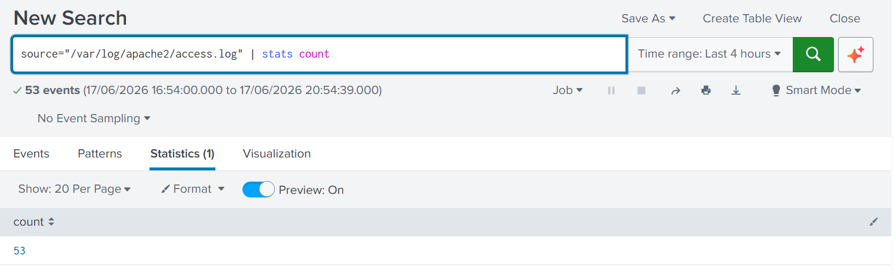
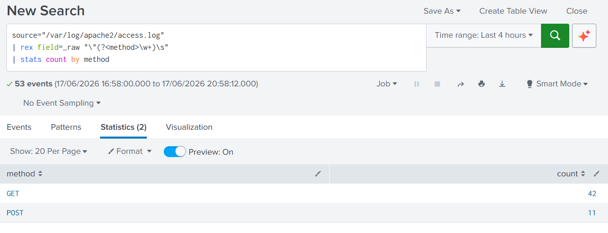
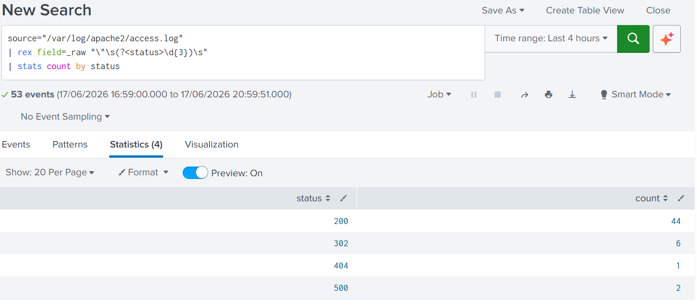
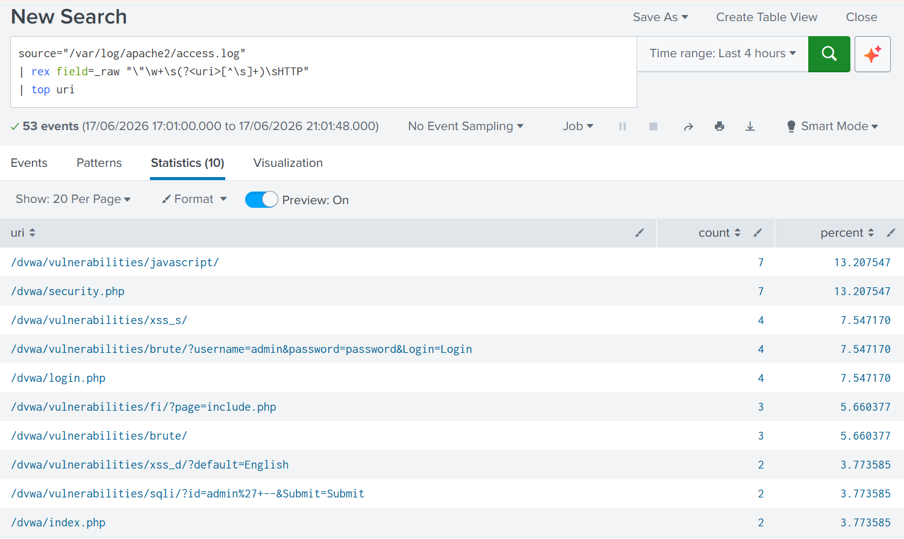
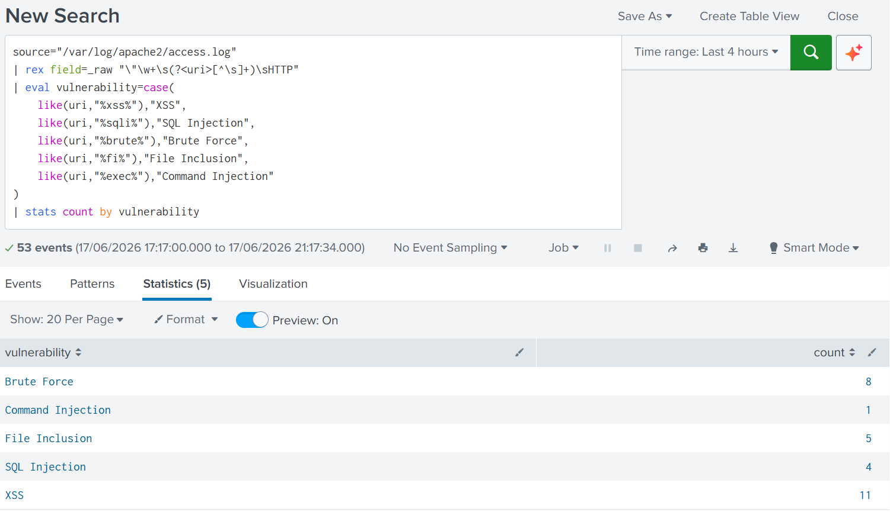

# DVWA Security Monitoring Using Splunk


## Overview

This project demonstrates the use of Splunk Enterprise to monitor and analyze web application activity generated from DVWA (Damn Vulnerable Web Application).

A homelab environment was built using Splunk Enterprise, Kali Linux, Apache, DVWA, and a Splunk Universal Forwarder. Apache access logs were collected and forwarded to Splunk, where SPL queries were used to investigate web activity and visualize findings through a custom dashboard.

## Objective

The objective of this project was to collect, monitor, and analyze DVWA web application activity using Splunk Enterprise. Apache access logs were ingested through a Splunk Universal Forwarder and investigated using SPL queries and dashboards.

## Skills Demonstrated

* SIEM Monitoring
* Log Analysis
* SPL (Search Processing Language)
* Apache Web Log Analysis
* Dashboard Creation
* Security Event Investigation
* Log Ingestion and Forwarding
* Data Visualization using Splunk

## Tools Used

* Splunk Enterprise
* Splunk Universal Forwarder
* Kali Linux
* Apache2
* DVWA
* GitHub

## Project Workflow

```text
DVWA Activity
      ↓
Apache Access Logs
      ↓
Splunk Universal Forwarder
      ↓
Splunk Enterprise
      ↓
SPL Queries
      ↓
Dashboard Visualization
```


## Dashboard



## Lab Environment

### Components

* Splunk Enterprise
* Splunk Universal Forwarder
* Kali Linux Virtual Machine
* Apache Web Server
* DVWA (Damn Vulnerable Web Application)

### Architecture

```text
Windows Host
│
├── Splunk Enterprise
│
└── Kali Linux VM
    ├── Apache
    ├── DVWA
    └── Splunk Universal Forwarder
```

## Data Source

Apache access logs collected from:

```text
/var/log/apache2/access.log
```

These logs contain information such as:

* Requested URLs
* HTTP Methods
* Response Status Codes
* Timestamps
* Client Activity

## Activities Performed

The following DVWA modules were used to generate log data:

* Brute Force
* Reflected XSS
* Stored XSS
* SQL Injection
* File Inclusion
* Command Injection
* Login and Logout Activity

## Analysis

### Total Requests

Apache access logs were analyzed to determine the total number of requests generated during DVWA testing. This provided a baseline view of overall web activity within the lab environment.



### HTTP Methods

HTTP methods were analyzed to understand the types of requests generated during DVWA testing. GET requests were commonly observed during page navigation and vulnerability testing, while POST requests were generated when submitting forms and payloads.



### HTTP Status Codes

Response codes were analyzed to identify successful requests, redirects, and errors encountered during testing.

* **200** – Successful request
* **302** – Redirect
* **404** – Resource not found
* **500** – Internal server error



### Most Visited Pages

The most frequently accessed pages were identified to determine which DVWA modules generated the highest amount of activity during testing.



### Vulnerability Activity

Requests were categorized based on the DVWA vulnerability module being accessed. Activity related to XSS, SQL Injection, Brute Force, File Inclusion, and Command Injection was successfully identified and visualized.



## Key Findings

* Successfully ingested Apache access logs into Splunk using a Universal Forwarder.
* Generated and analyzed activity from XSS, SQL Injection, Brute Force, File Inclusion, and Command Injection modules within DVWA.
* Observed both GET and POST requests generated by different application functions.
* Identified HTTP response codes including 200, 302, 404, and 500.
* Correlated user actions performed within DVWA to events observed in Splunk.
* Built a custom Splunk dashboard to visualize web application activity and security events.

## Conclusion

This project provided hands-on experience with log ingestion, SPL query development, web log analysis, and dashboard creation using Splunk Enterprise. By monitoring DVWA activity through Apache access logs, it demonstrated how a SIEM platform can be used to investigate, analyze, and visualize web application events in a controlled lab environment.
